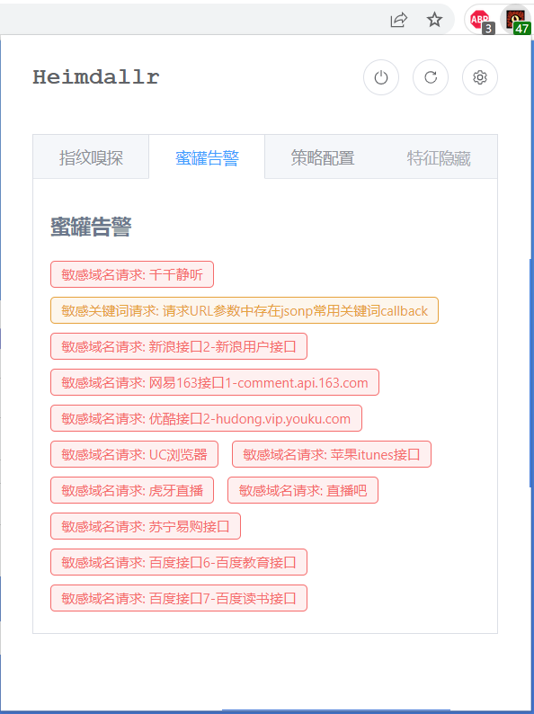
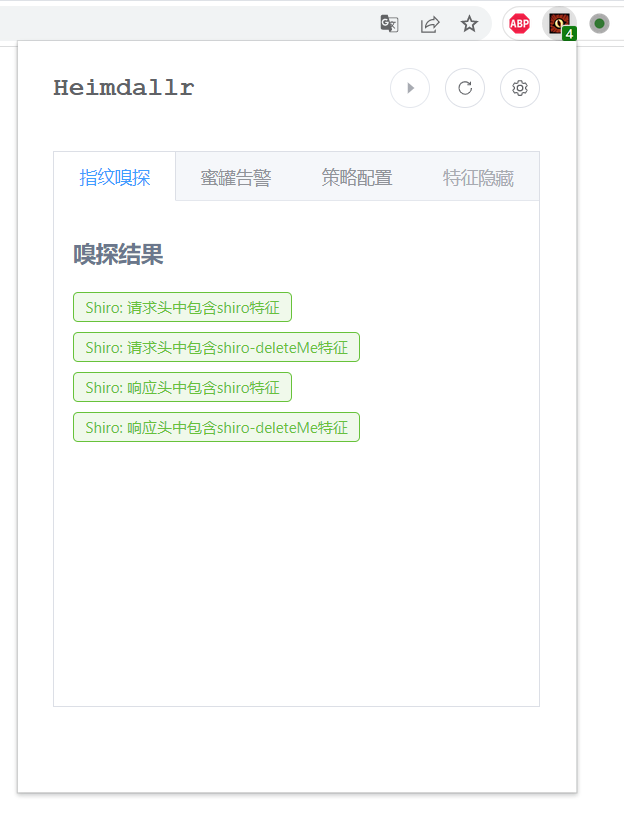
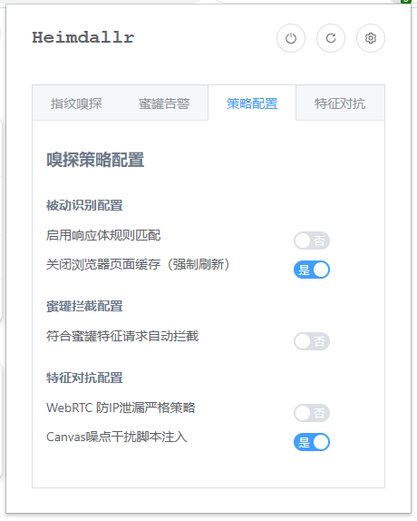

# Heimdallr

被动嗅探高危指纹和蜜罐特征，并进行拦截告警的谷歌插件

同时进行了evercookie、webRTC、Canvas画布等溯源特征的对抗

## 安装

1. GitHub release 下载最新版本编译后插件

2. Chrome-扩展设置-开发者模式-加载已解压的扩展程序

要求：Chrome版本至少Chrome 96，部分代码逻辑不适配edge和firefox，请勿混用

## 使用

1. 高危指纹识别和蜜罐jsonp请求识别功能无需配置，只要插件开启即可生效
2. 右上角三个选项分别为暂停/开启插件、刷新所有嗅探结果集、跳转设置界面（内容同策略配置标签）
3. 扩展功能可参考策略配置页面
    - 被动识别配置
        - 启用响应体规则匹配
            - 默认情况下，静态嗅探只对url、request header、request body、response header进行匹配，仅有少部分高危指纹在response body中检测，开启该选项后会启用网页调试工具，检测response body中的指纹。但是启用该选项后会出现调试提示栏，关闭方式参考高级-4
            - 建议使用场景：仅在部分需关注页面开启该选项，用完即关

        - 关闭浏览器页面缓存（强制刷新）
            - 部分包含特征规则的静态资源（如js文件）会在一次调用后存储在磁盘中，减少重复加载耗费的流量和带宽。这会导致识别规则在重复刷新页面是不会重复触发。开启该选项后可以达到更完善的特征识别，这也可以防止部分情况下静态资源文件不能及时更新导致的访问异常
            - 建议使用场景：默认开启该选项

    - 蜜罐拦截配置
        - 符合蜜罐特征请求自动拦截
            - 为保证能够识别、阻断部分新的Jsonp请求，插件按照请求域名进行拦截，这会导致开启该选项后访问部分日常网站（CSDN、GitHub等）会被阻断，影响日常访问。因此默认情况下插件不会拦截疑似蜜罐的Jsonp请求，需要手动开启拦截选项
                - 日常网站被拦截也可以通过右上角的暂停插件按钮暂停，访问结束后重新启动插件。但是更建议的方式为日常使用浏览器和攻击使用浏览器分离开来，专事专用

            - 建议使用场景：攻击期间开启

    - 特征对抗配置
        - WebRTC 防IP泄露严格策略
            - 通过提高WebRTC策略严格度防止真实IP泄露，已知chrome最新版本（截至2022.9.1）仍存在该漏洞，此选项可在并建议在日常使用时开启
            - 建议使用场景：手动开启该选项

        - Canves噪点干扰脚本注入
            - 通过注入脚本增加Canvas导出为图片时的噪点防止特征锁定，此选项可在并建议在日常使用时开启。开启后所有网页访问时将会额外加载inject.js用于相关操作，无需额外关注
            - 建议使用场景：攻击期间开启

## 高级

1. 插件的识别对象基于【标签页】，标签页中访问页面变更【域名+端口/IP+端口】时清空结果，切换标签页时结果会暂存，关闭标签页或窗口时删除对应结果

2. 插件默认只存在被动流量监控，不会因为敏感指纹的识别触发防火墙处置

3. 插件识别结果为页面及页面子框架的请求内容，部分页面告警【请求体数据为json格式】、【请求头Content-Type为application/json格式】时，不一定是当前document的请求，有可能是当前document页加载的相关页面的接口请求满足规则

4. 因为谷歌Chrome api的安全限制和Chrome内核的历史遗留问题，插件对响应体Body的检查与其他指纹位置的检查不同，浏览器页面顶部会出现调试提示，可通过插件设置关闭响应包检查功能或添加谷歌浏览器的启动项规避提示（在Chrome快捷方式右键打开属性，在快捷方式栏的【目标】框添加启动参数 --silent-debugger-extension-api）

5. 插件关闭缓存功能开启后，页面响应不会被缓存，可能会稍微增加流量和内存使用

6. 插件目的为发现直接访问无法识别的组件或框架，请勿添加可以直接识别的组件的特征到指纹库（如spark未授权页面），增加无意义的识别流程导致页面加载延迟。

## 致谢

https://github.com/iiiusky/AntiHoneypot-Chrome-simple

https://github.com/cnrstar/anti-honeypot

https://github.com/Monyer/antiHoneyPot

https://github.com/fuckjsonp/FuckJsonp-RCE-CVE-2022-26809-SQL-XSS-FuckJsonp

https://github.com/aghorler/WebRTC-Leak-Prevent

https://github.com/EdgeSecurityTeam/EHole

https://mybrowseraddon.com/canvas-defender.html

## 许可证

使用 GPL V2 协议发行，详情参见LICENSE
